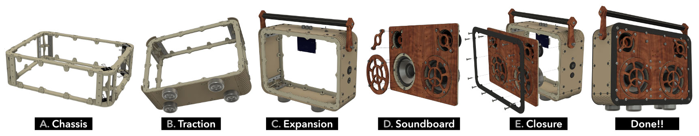

# mojofesto-kit
Freedom is making and sharing the coolest boombox ever. MAKEBOOMBOXES has open sourced to the public our MOJOFESTO DIY kit boombox. The MOJOFESTO is a powerful, portable, customizable and collaborative bluetooth speaker. Why give away this refined design and DIY instructions to the public after investing 8 years of development and experiment? What does it take to get building your own boombox? [Read our blog post](https://makeboomboxes.com/blogs/news/we-open-sourced-our-boombox-design) for more of the story.

# MAKEBOOMBOXES: MOJOFESTO DIY Boombox

Welcome the home of the MOJOFESTO open source DIY kit boombox project. Whether you're a seasoned maker or a curious newbie, the MOJOFESTO project is designed to be freely accessible to everyone, and clearly organized into logical build milestones:

## Project Description

At MAKEBOOMBOXES, we believe in freedom - the freedom to make and share some of the coolest boomboxes ever. By open sourcing the MOJOFESTO design, we aim to empower audio enthusiasts, DIY makers and entrepreneurs to make their own high-quality portable bluetooth speakers and adapt the design to their needs. This repository includes complete manufacturing specifications, assembly documentation, a detailed bill of materials and tools list. 

## Why make a DIY boombox?

In a distressed World that looks like we might not make it, why build something to last? When things are more disposable and people more isolated than ever, why strive for musical connection in our communities? When rising selfishness and distrust threaten to pull us apart, why put this thing together? … Yes, that’s exactly why. 

Inside every home-made boombox is a call for togetherness; proof that we can create durable, joyful, musical experiences to share. 

Behind each unique home-made high-quality boombox is a maker to show that: Yes. We can make it.

## Features
**Refined Sound:** Experience lavish, detailed, spacious sound with the MOJOFESTO's innovative resonant enclosure.
**Meaningful Design:** The emotive retro-future visual persona makes it a centerpiece and a conversation piece.
**Portable:** Make the world your listening room with the MOJOFESTO's portable design and long-lasting battery life.
**Modular:** Customize your boombox with different colors, materials, and add-ons to make it uniquely yours.

## How to Build the MOJOFESTO

Building your own MOJOFESTO boombox is an exciting project that involves basic wood-working and electronics assembly and a bit of craftsmanship. Here’s how to get started:

### Parts Needed

For an overview list of all parts needed, see the "get started" PDF in the docs folder.

Many of the parts are laser cut by you if you own or have access to a laser cutter, or they can be ordered from online laser-cut-to-order services like Panoko or Send Cut Send. The other parts are fasteners, wiring/connectors, and OEM electronics parts.

For a detailed bill of materials with links to supplier sources, see the spreadsheet file in the bom folder.

### Tools Needed

For a complete list of all tools needed, see the "get started" PDF in the docs folder.

### Time Needed

Once all parts and tools are gathered / made, the total boombox can be made in one weekend-long project, or in 5 to 6 sessions of 1 or 2 hours each. 

### Assembly Instructions

See detailed assembly guides in the docs folder of this repository. 

The milestones and steps of the build, listed below, are accomplished by performing the build tasks and quality checks documented in the assembly guides.

A. **Chassis:** Bracket tabs, ribs, frame bulkheads, corner bracings, corner curve walls, bottom wall

B. **Traction:** Feet, handle arms, handle bar

C. **Expansion:** Kill switch, amp board, charging jack, USB  out, Aux in, 3 walls, handle assembly 

D. **Soundboard:** Speaker rings, wings, battery straps and brackets, speakers, speaker covers

E. **Closure** Front borders, art face magnets, connect wiring, tidy wires, back borders

### Testing

Check off each item in the testing checklist provided at the end of each build step in the assembly guide, to ensure you're ready to move on to the next step.

## How to Operate and Customize the MOJOFESTO

To operate (and if necessary troubleshoot) the boombox to function correctly, see the Operation and Customization Guide in the docs folder. In that same document there are also customization tips and ideas.

## How to Contribute to the Project

We thrive on community contributions! Here are ways you can contribute:

1. **Improving Documentation**: Help us improve instructions or translations.
2. **Design Modifications**: Submit design modifications or enhancements.
3. **Feature Requests**: Have ideas for new features? Submit an issue to discuss.
4. **Bug Reports**: Found a problem? Let us know by opening an issue.

## License

This project is released under the guidelines set forth in the [Open Source Hardware (OSHW) Statement of Principles 1.0](https://www.oshwa.org/definition/). By using the design and documentation of the MOJOFESTO project, you agree to abide by its terms.

Open Source Licenses

- Hardware: [CERN-OHL-W-2.0](CERN-OHL-W-2.0.md) CERN Open Hardware Licence Version 2 - Weakly Reciprocal
- Software: not applicable to this project
- Documentation: [CC-BY-SA-4.0](CC-BY-SA-4.0.md) Creative Commons Attribution-ShareAlike 4.0 International

## Contact

For any additional questions or to join our community, please contact us at [email](mailto:gitadmin@makeboomboxes.org) or join our community forum linked on the project homepage.

Happy building!
